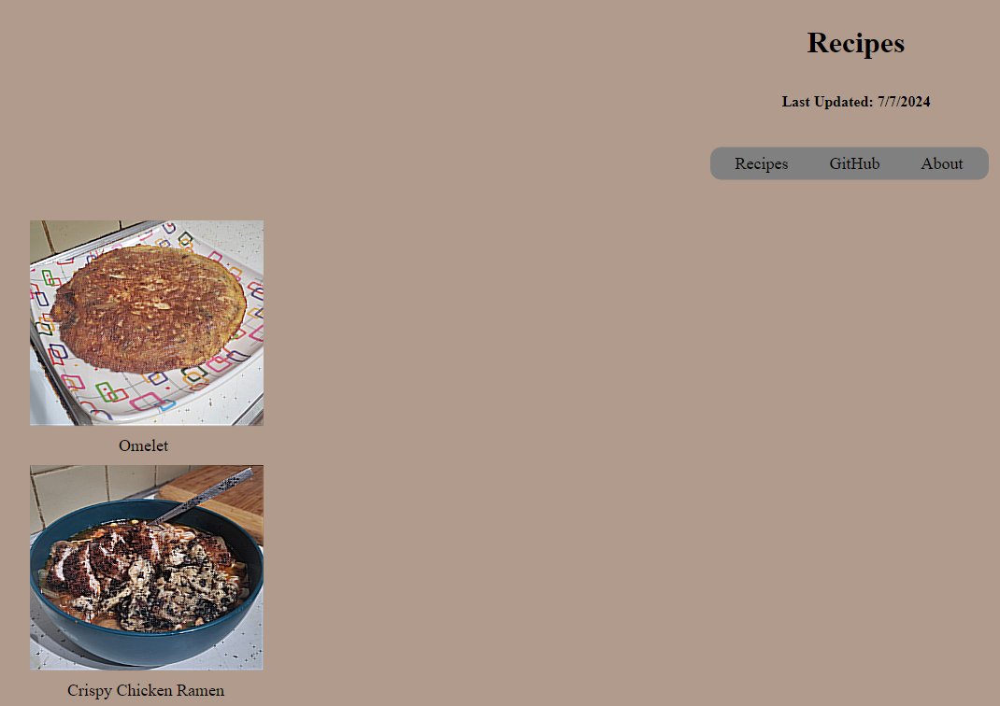
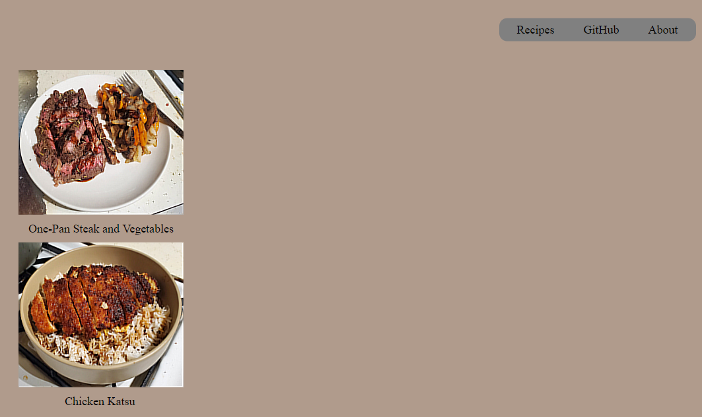
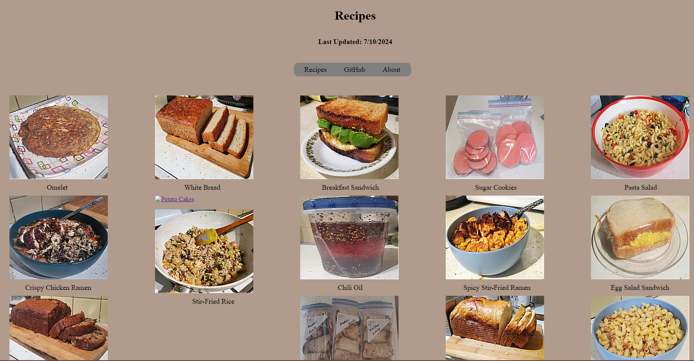

# Website

This project is a digital website archive I'm building that contains all my recipes, redirects to my GitHub repositories, and a bunch of other stuff.

This project is in continuous progress.

## How to run the website:

Open a web browser of your choice and copy/paste or click the following link:

	https://rushobinnabi.github.io
---

# Version 2.1.0 Updates:
#### - Updated the recipes to be contained and spread out within a single page (for now): 
- Before:
    - Page 1:
      - 
    - Page 2:
      - 
- After:
    - 
#### - The picture for the Potato Cakes recipe will be added later.