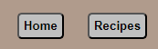
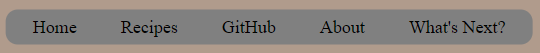
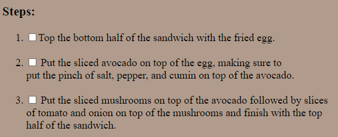
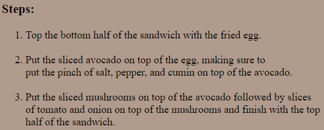
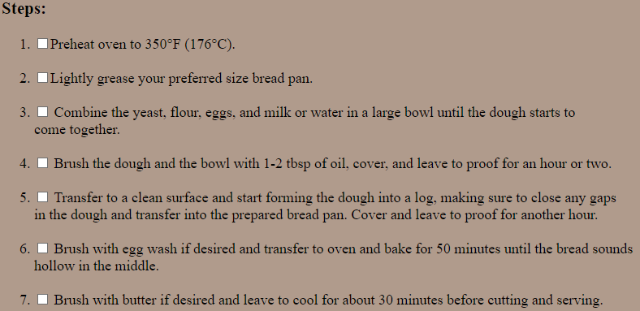
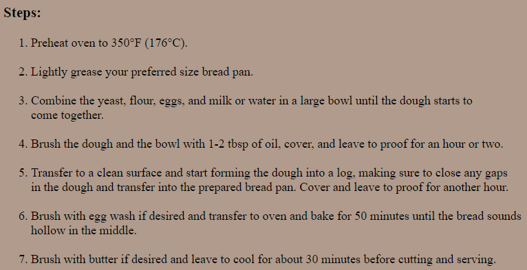

# Website

This project is a digital website archive I'm building that contains all my recipes, redirects to my GitHub repositories, and a bunch of other stuff.

It is in continuous progress.

It is built ideally for Desktop.

## How to run the website:

Open a web browser of your choice and copy/paste or click the following link:

	https://rushobinnabi.github.io
---

# Version 2.2.0 Updates:
#### - Removed the buttons at the bottom of the recipe pages and updated the navbar to include the homepage:
 - Before:
   - 
 - After:
   - 
#### - Added a "What's Next?" page and button to the navbar to show what kind of things might be coming to the website:
  - 
#### - Removed the ability to check off the steps to the recipes:
 - Before:
   - 
 - After:
   - 
#### - Fixed the links to the browser tab icons.
#### - Updated the White Bread recipe:
 - Before:
   - 
 - After:
   - 